<!--suppress ALL -->
<div align='center'>

[![header]][home]

  <p align="center">
      
      <a href="https://wakatime.com/@ea22cbac-f1f5-4e51-a8ba-aa812b46f257">
          
      </a>
  </p>

  <!--  -->

</div> <br />

<!-- ```go
func selfIntroduction() map[string]string {
	var Snowball_233 = make(map[string]string)
	Snowball_233 = map[string]string{
		"Job"       : "High school student",
		"Work in"   : "Vastsea, FloraCore, INF Network"
		"Hobby"     : "Math, Coffee, Music",
		"Game"      : "Minecraft, PVZ"
		"Active in" : "QQ, Telegram"
		"Ability"   : "Premiere Pro, DaVinci",
		"Fortune"   : "Poor",
		"System"    : "Windows, Ubuntu",
		"Editor"    : "JetBrains Tools, VSCode, Dev-C++",
		"Learning"  : "C++, Go, Rust, Python",
		"DevOps"    : "Docker, GitHub Actions",
	}
	return Snowball_233
}
``` -->

## 👋 TL;DR

学生, 就读于 `天津师范大学` / 开发者

* [瀚海工艺 Vastsea](https://github.com/TeamVastsea) 联合创始人
* [苦力怕论坛 klpbbs](https://klpbbs.com/) 技术总管 & 版主
* [course.rs《Rust 语言圣经》](https://course,rs) Collaborator
* [MedgeAI](https://medgeai.cn) 前端开发实习中

Web / Rust / 开源 / LLM / AGENT / AI

---

## 🧠 About me

我是个在读学生，目前主要方向是 **Web 前端**、**AI Agent**。

### 我在干啥

* 和朋友一起折腾 **Vastsea**，从想法到上线，从前后端代码到 CI/CD，全流程踩坑
* 在 **苦力怕论坛** 担任技术总管兼版主，负责主导论坛重构计划推进
* 给 **course.rs《Rust 语言圣经》** 做协作，修坑、补内容、处理 Issues & Pull Requests
* 在 **medgeai 技术部** 做前端实习，接触真实业务和工程流程

### 我喜欢

* 喜欢把复杂问题拆简单
* 对开源和长期维护的项目有耐心

<p align="center">
    <a>
        
        <a>
            <h1 align="center">Contact Me</h1>
            <div align="left">
                <span>QQ : 2957202260</span> <br />
                <span>Email : </span> <a href="mailto:snowballstudio233@gmail.com">snowballstudio233@gmail.com</a> <br />
                <span>Blog : </span> <a href="https://blog.qwq.my">blog.qwq.my</a> <br />
                <span>Telegram : </span> <a href="https://t.me/Snowball_233">@Snowball_233</a> <br />
                <span>Discord : SnowballXueQiu</span> 
            </div>
        </a>
    </a>
    <br />
</p>

<!-- <div align="center">
	
</div> -->


<div align="right">
    Designed with :heart: by <a href="https://github.com/SnowballXueQiu" target="_blank">Snowball_233</a>.
</div>


[home]: https://github.com/SnowballXueQiu
[header]: https://capsule-render.vercel.app/api?type=Waving&color=timeGradient&height=200&animation=fadeIn&section=header&text=Snowball_233&fontSize=50
